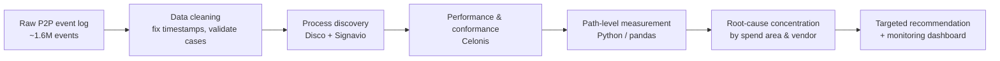

# Process Mining — Invoice-Clearing Bottleneck (Purchase-to-Pay)

> Finding, quantifying and explaining a hidden delay in a 1.6M-event procurement process using **Signavio, Celonis, Disco and Python** — then recommending a targeted, evidence-based fix.


## TL;DR

Working with a real-world **Purchase-to-Pay (P2P)** event log (the public *BPI Challenge 2019* dataset, ~1.6M events), I investigated the delay between **`Record Invoice Receipt`** and **`Clear Invoice`**. The analysis showed the delay was **not** spread evenly across the business — it was heavily concentrated, which turns a vague "invoices are slow" complaint into a specific, actionable target.

**Key findings**

| Metric | Result |
|---|---|
| Valid cases analysed (Record Invoice Receipt → Clear Invoice) | **183,161** |
| Cases taking **> 70 days** to clear | **46,465 (25.4%)** |
| Mean / median clearing time | **48.2 / 42.1 days** |
| 90th-percentile clearing time | **97.1 days** |
| Share of all slow cases in the **Packaging** spend area | **~80.6%** |
| Slow-case share of the **top 3 vendors** | **~47.8%** |
| Slow-case rate for cases with **`Remove Payment Block`** | **33.2%** (vs 22.6% without exceptions) |

**Recommendation:** rather than a generic process-wide fix, prioritise **automated invoice matching and exception handling for high-delay Packaging vendors**, plus a monitoring dashboard that flags cases before they cross 30 / 45 / 60 days.

## Why this matters

Invoice clearing sits near the end of P2P, close to financial settlement. Delays here hit **payment timeliness, supplier relationships and working capital** — so shaving the long tail has a direct cash and relationship benefit.

## Approach



1. **Process discovery (Disco + Signavio).** Located the invoice-clearing segment inside the wider P2P model and confirmed it is high-volume (227,658 `Record Invoice Receipt` and 193,988 `Clear Invoice` events) — a routine path, not a rare exception. Signavio added the spend-area business view.
2. **Performance & exception analysis (Celonis).** Used adherence/deviation views to show the issue is a **performance bottleneck within expected behaviour**, and that exception activities (`Remove Payment Block`, `Change Quantity`, …) are associated with slower clearing.
3. **Path-level measurement (Python).** Tool UIs don't directly measure the *specific* Record-IR → Clear-Invoice duration, so I wrote a pandas script to compute it per case, flag cases over a 70-day threshold, and aggregate concentration by spend area and vendor. See [`scripts/analyze_b1_bottleneck.py`](scripts/analyze_b1_bottleneck.py).
4. **Root cause → recommendation.** Showed the delay concentrates in **Packaging** and a handful of vendors, then proposed a proportionate fix targeting exactly that segment.

## What the Python script does

`analyze_b1_bottleneck.py` reads the cleaned event log in chunks (memory-safe for a multi-hundred-MB CSV), and:

- validates the `Complete Timestamp` column and **refuses to compute durations if timestamps are corrupted** (writing a data-quality report instead of misleading numbers);
- computes, per case, the elapsed days from the first `Record Invoice Receipt` to the next `Clear Invoice`;
- flags cases over a configurable threshold (default 70 days);
- writes concentration summaries by spend area, by vendor, and by spend-area × vendor.

```bash
python scripts/analyze_b1_bottleneck.py --input path/to/event_log.csv --threshold-days 70
```

## Skills demonstrated

Process mining (discovery, conformance, performance) · multi-tool workflow (Disco / Signavio / Celonis) · Python data engineering on large event logs · data-quality validation · root-cause / concentration analysis · translating analysis into a costed, prioritised business recommendation.

## Notes on data & academic integrity

This repository contains **my own analysis code and a written case study**. It does **not** include the raw dataset or any course-provided materials. The dataset is the publicly available **BPI Challenge 2019** log (4TU.ResearchData); please obtain it from the original source if you wish to reproduce the analysis.

---

*Developed as part of the Business Process Analytics unit, Master of Data Analytics, QUT.*
